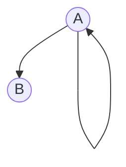
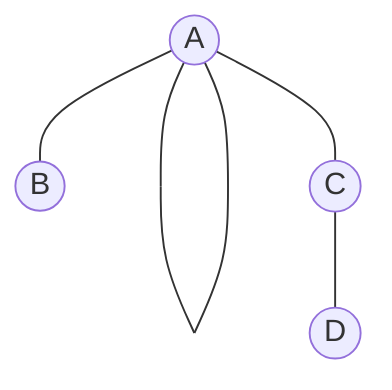

### SimpleDG
SimpleDG is a text editor for defining graphs in the [DOT language](https://graphviz.org/doc/info/lang.html). 
The tool is developed with Java and [Xtext](https://www.eclipse.org/Xtext/). 

#### Specify a directed graph
A directed graph is represented as a list of of edges. For instances, [example1](examples/example1.dot) below
```
digraph g{
	A => A
	A => B
}
```
corresponds to the following directed graph


#### Specify an undirected graph
An undirected graph is represented as a list of of edges. For instances, [example2](examples/example2.dot) below
```
graph{
	A == A
	A == B
	A == C
	C == D
}
```
corresponds to the following undirected graph



#### Syntactic checkers
Creating a file with the extension _.dot_ activates Xtext native syntax highlighting and syntactic checker.

#### Requirements
The project has been built and tested on the following systems

- Windows 11 Pro, Eclipse 2023-06, Java 17 (included with Eclipse), Xtext 2.31
- macOS Ventura 13.4.1, Eclipse 2022-12, Java 11, Xtext 2.29
- Ubuntu 22.04.2, Eclipse 2022-09, Java 11, Xtext 2.31 

