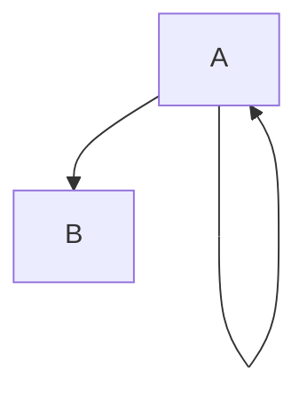

### SimpleDG

SimpleDG is a text editor to specify [directed graphs](https://en.wikipedia.org/wiki/Directed_graph).
The tool is developed with Java and [Xtext](https://www.eclipse.org/Xtext/). 

#### Specify a directed graph

A directed graph is represented as a list of nodes and a list of edges. For instances, the following
```
Nodes:
	A 
	B
;
Edges:
	A -> A
	A -> B
;
```
corresponds to the following directed graph



#### Syntactic checkers

Creating a file with extension _.sdg_ activates Xtext native syntax highlighting and syntactic checker. Moreover, as an example, the editor implements a custom  syntactic checker that returns an error if the nodes used in the Edges section are not defined in the Nodes section. For instance, the following example triggers an error. 
```
Nodes:
	A 
	B
;
Edges:
	A -> A
	A -> B
	A -> C
	C -> D
;
```


