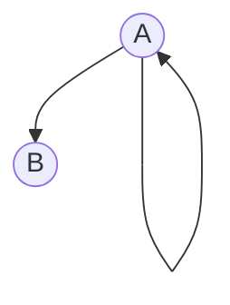
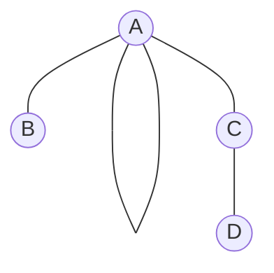

### Examples of graphs
This folder contains some examples of graphs that can be implemented with SimpleDG.

#### Example 1
File [example1](example1.dot) 
```
digraph g{
	A => A
	A => B
}
```
corresponds to graph



#### Example 2
File [example2](example2.dot) 
```
graph{
	A == A
	A == B
	A == C
	C == D
}
```
corresponds to graph



#### Example 3
File [example3](example3.dot) 
```
digraph {
	a => b
	b => c
	c => c
}
```
corresponds to graph
```mermaid
graph TD
	id1((a)) -> id2((b))
	id2((b)) -> id3((c))
	id3((c)) -> id3((c))
```
